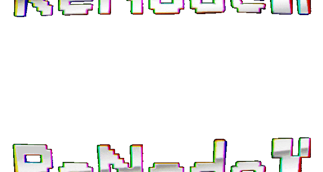

  

  
  
  
  

 

⚙️ Software engineer specializing in AI-driven automation systems and intelligent infrastructure. 
I architect production-grade solutions that bridge the gap between raw machine learning capabilities 
and real-world business applications — from autonomous data pipelines and conversational AI agents 
to sophisticated lead generation systems operating at scale.

My work sits at the intersection of backend engineering and applied artificial intelligence: 
designing resilient architectures, implementing complex integrations, and building systems 
that make autonomous decisions with measurable impact.

 

  
  
  

 

  <code>Node.js</code> · <code>OpenAI / LLM</code> · <code>Telegram API</code> · <code>Event-Driven Architecture</code> · <code>Automation Pipelines</code>

